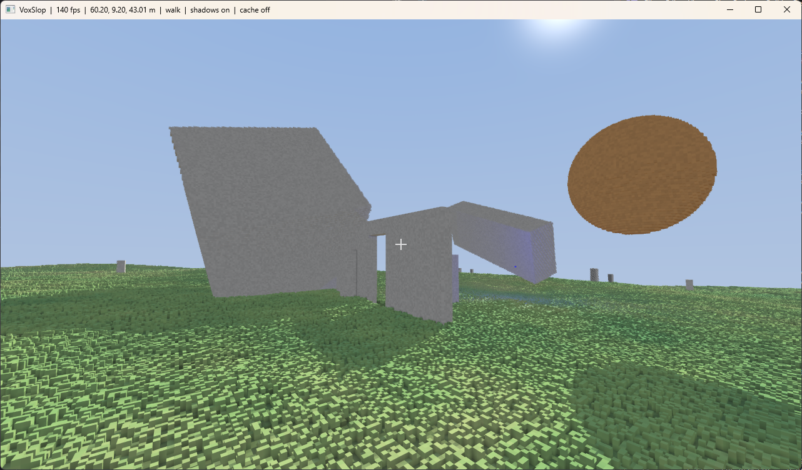
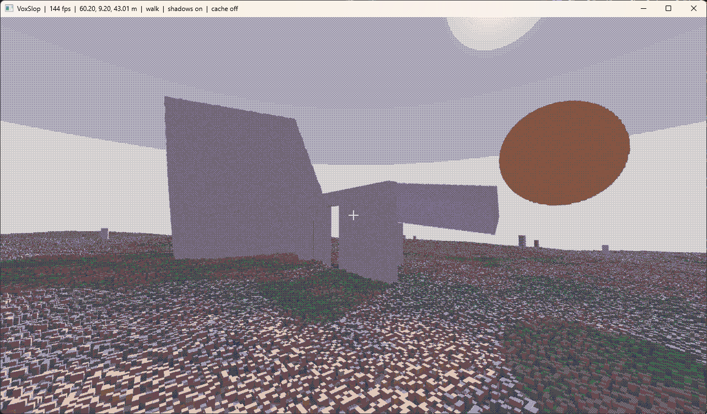

# VoxSlop





A voxel-based 3D FPS tech demo. Unlike Minecraft-style games where voxels are
metre-scale cubes, VoxSlop works at centimetre scale — currently 5 cm voxels —
so a modest landscape is made of *billions* of voxels. The whole world is drawn
by GPU raymarching, with no meshes involved.

## Characteristics

- **Tiny voxels** — 5 cm, giving a ~102 × 51 × 102 m world of ~4 billion voxel slots.
- **Meshless rendering** — fragment shaders raymarch the world; render cost scales
  with screen resolution, not voxel count.
- **Sparse "brickmap" storage** — empty and uniform regions cost no memory, so the
  world fits in tens of MB rather than gigabytes.
- **Distance LOD** — each brick has a downsampled mip so far-off voxels don't shimmer.
- **Temporal anti-aliasing** with reprojection, variance clipping and disocclusion rejection.
- **Lighting** — animated day/night sun with voxel-quantised, GPU-cached shadows;
  an orbiting coloured point light; and geometry-based ambient occlusion.
- **Dynamic objects** — spinning boxes/spheres re-voxelised onto the world grid each
  frame, that cast and receive shadows.
- **Visual styles** — hard cubes, rounded blobs, sphere/bead voxels, and a retro
  fixed-palette + dither filter, all toggleable at runtime.
- Procedural terrain and grass, and a cached world that loads instantly on later runs.
- **FPS controls** — walk with gravity/jump and step-up over terrain, plus a noclip fly mode.

## Requirements

- .NET 10 SDK
- A GPU supporting OpenGL 4.3 (shader storage buffers)

## Build & run

```sh
dotnet run --project VoxSlop.App
```

## Controls

| Key | Action |
| --- | --- |
| Mouse | Look |
| WASD | Move (Shift to sprint) |
| Space / Ctrl | Jump / fly up · fly down |
| F | Toggle walk / noclip |
| L | Toggle sun shadows |
| O | Toggle ambient occlusion |
| P | Pause / resume the sun |
| C | Toggle the per-voxel-face shadow cache |
| G | Toggle the orbiting point light |
| T | Toggle temporal anti-aliasing |
| V | Toggle rounded-blob voxels |
| B | Toggle sphere / bead voxels |
| K | Toggle retro palette + dither |
| F11 | Toggle borderless fullscreen |
| R | Reload shaders from disk |
| Esc | Release / recapture the cursor |

## Tech

Built on [.NET 10](https://dotnet.microsoft.com/) and
[Silk.NET](https://github.com/dotnet/Silk.NET) (windowing, input, OpenGL).
See [CLAUDE.md](CLAUDE.md) for architecture notes and [STYLE.md](STYLE.md) for
the code-maintainability rules to follow when contributing.
